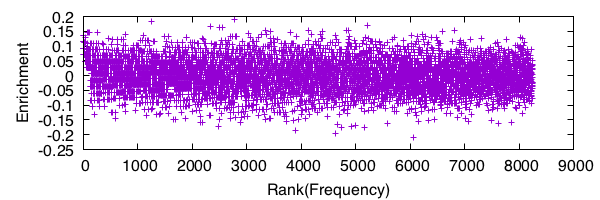

# Method

## Sequence Trimming

The FASTQ files consist of four lines per read. The second of these lines contains the sequence of the read. Each sequence line is extracted and, together with its reverse complement, searched for the 5' and 3' primers. If a 5' primer is found followed by a 3' primer, the interceding sequence (i.e. the oligomer) is extracted. The oligomer is kept only if it is 20 nucleotides in length. This computational procedure is performed for all of the reads in each FASTQ file.

## Kmer Extraction

Each oligomer is decomposed into k-mers. For example, for k=9, the oligomer 

```
ATGCATGCATGC
```

is decomposed into the following sequences:

```
ATGCATGCA
 TGCATGCAT
  GCATGCATG
   CATGCATGC
```

The resulting k-mers (k=5, ..., 15) are tabulated for rounds 1 and 2 and then the resulting tables are joined. The resulting table, hereafter referred to as the k-mer table, contains three columns, with one row per k-mer. The first column is the sequence of the k-mer, the second column is the number of times the k-mer is found in round 1, and the third column is the number of times the k-mer was found in round 2. These counts were converted to a frequency value to adjust for unequal sample sizes between rounds. 

## Choosing K Using KL Divergence

The Kullback-Leibler (KL) divergence is a pseudo-distance metric for probability distributions. It is used to measure the difference between the k-mer distributions of rounds 1 and 2. A high KL divergence between rounds suggests a substantial change the k-mer distirbution, which in turn suggests substantial selective pressure. We assume that the most substantial selective pressure would come from binding of the k-mer to the protein and therefore look to the KL divergence to select the most relevant value of k. 

## Generalized Log Transformation of Frequency Values

Before calculating enrichment for the k-mers, a generalized log (glog) transform is applied to the frequency values of the k-mer table. The purpose of this transform is to alleviate bias towards high-frequency k-mers. The bias likely occurs because the DNA from which a k-mer arises acts as its own catalysts during PCR, causing the extent of change (enrichment or depletion) between rounds to scale with the frequency level of the k-mer. Empirically, the square root transform was found to correct for this (see Results). 

# Results

The KL divergence was used to select the most relevant value of k. The KL divergence reached its highest point around k=10, 11, and 12. The rest of the analysis focused on these k-mers. 

The generalized log (glog) transform was found to stabilize the variance in enrichment/depletion values across the k-mer pools (Figure 1, 2).




Enrichment was calculated as the difference between the glog-transformed frequency values of rounds 1 and 2. The most enrichmed k-mers are compared against those of the negative control (Figure 3, 4, 5).


The following tables highlight the most enriched k-mers and their associated values for both 89aa and NC.

## K = 10

### 89aa

Sequence      |  Cnt1  |  Cnt2  |  Freq1  |  Freq2  |  V1      |  V2      |  Delta
--------      |  ----  |  ----  |  -----  |  -----  |  --      |  --      |  -----
`GATACCCTGG`  |  15    |  30    |  0.039  |  0.081  |  -1.971  |  -1.709  |  0.262
`CAGATGCTAC`  |  23    |  39    |  0.060  |  0.105  |  -1.831  |  -1.583  |  0.248
`ATTGCTGCGT`  |  52    |  75    |  0.136  |  0.202  |  -1.443  |  -1.196  |  0.247
`CGGAAACGGT`  |  37    |  56    |  0.097  |  0.151  |  -1.625  |  -1.382  |  0.243
`AGGCTGCTAT`  |  16    |  30    |  0.042  |  0.081  |  -1.953  |  -1.709  |  0.243
`GAATGGGACA`  |  22    |  37    |  0.058  |  0.100  |  -1.848  |  -1.610  |  0.237
`CTCTCGGCTA`  |  40    |  59    |  0.105  |  0.159  |  -1.586  |  -1.350  |  0.236
`GGTGGCCGCC`  |  60    |  83    |  0.157  |  0.224  |  -1.358  |  -1.127  |  0.231
`ATGGCCTTCG`  |  43    |  62    |  0.113  |  0.167  |  -1.548  |  -1.319  |  0.229
`ACGTGTAGCT`  |  43    |  62    |  0.113  |  0.167  |  -1.548  |  -1.319  |  0.229

Table: Maximally enriched 12-mers for NC (Cnt: Count, Freq: Frequency, V: Variance Stabilized Frequency, Delta: Change in V between R2 and R1)

### NC

Sequence      |  Cnt1  |  Cnt2  |  Freq1  |  Freq2  |  V1      |  V2      |  Delta
--------      |  ----  |  ----  |  -----  |  -----  |  --      |  --      |  -----
`GCACGAATGT`  |  40    |  62    |  0.100  |  0.163  |  -1.610  |  -1.336  |  0.274
`AGGCCAGTCA`  |  37    |  58    |  0.092  |  0.152  |  -1.648  |  -1.377  |  0.271
`AATCGTCACC`  |  30    |  49    |  0.075  |  0.129  |  -1.743  |  -1.475  |  0.268
`CAAGGTCACC`  |  36    |  56    |  0.090  |  0.147  |  -1.661  |  -1.398  |  0.263
`GGGCACCGAA`  |  37    |  57    |  0.092  |  0.150  |  -1.648  |  -1.387  |  0.261
`TCAGCACCGA`  |  74    |  101   |  0.185  |  0.265  |  -1.256  |  -1.007  |  0.249
`TGACTCCCCA`  |  22    |  37    |  0.055  |  0.097  |  -1.865  |  -1.623  |  0.241
`CGGGCACCGA`  |  48    |  68    |  0.120  |  0.179  |  -1.514  |  -1.278  |  0.237
`TCCAGTCGCC`  |  63    |  86    |  0.157  |  0.226  |  -1.357  |  -1.121  |  0.236
`GCCAGTTACC`  |  40    |  58    |  0.100  |  0.152  |  -1.610  |  -1.377  |  0.233

Table: Maximally enriched 12-mers for NC (Cnt: Count, Freq: Frequency, V: Variance Stabilized Frequency, Delta: Change in V between R2 and R1)

## K = 11

### 89aa

Sequence       |  Cnt1  |  Cnt2  |  Freq1  |  Freq2  |  V1      |  V2      |  Delta
--------       |  ----  |  ----  |  -----  |  -----  |  --      |  --      |  -----
`AGGTGTCCGGG`  |  4     |  15    |  0.012  |  0.045  |  -2.193  |  -1.934  |  0.259
`GTACTGAGGCA`  |  5     |  16    |  0.014  |  0.048  |  -2.168  |  -1.914  |  0.254
`CACAATGCTGG`  |  9     |  21    |  0.026  |  0.062  |  -2.072  |  -1.818  |  0.254
`TGCGACGCCAT`  |  15    |  28    |  0.043  |  0.083  |  -1.943  |  -1.697  |  0.246
`TCACGTTGTGG`  |  11    |  23    |  0.032  |  0.068  |  -2.027  |  -1.782  |  0.245
`AGACGCACGCT`  |  11    |  23    |  0.032  |  0.068  |  -2.027  |  -1.782  |  0.245
`GTCACTGTGAA`  |  7     |  18    |  0.020  |  0.053  |  -2.119  |  -1.874  |  0.244
`GGGCGGCTCGG`  |  3     |  13    |  0.009  |  0.039  |  -2.220  |  -1.976  |  0.244
`CGTGCTCGGAG`  |  20    |  34    |  0.058  |  0.101  |  -1.848  |  -1.605  |  0.243
`GATGGCACACG`  |  29    |  45    |  0.084  |  0.134  |  -1.695  |  -1.454  |  0.241

Table: Maximally enriched 12-mers for NC (Cnt: Count, Freq: Frequency, V: Variance Stabilized Frequency, Delta: Change in V between R2 and R1)

### NC

Sequence       |  Cnt1  |  Cnt2  |  Freq1  |  Freq2  |  V1      |  V2      |  Delta
--------       |  ----  |  ----  |  -----  |  -----  |  --      |  --      |  -----
`GTCGGTCACCG`  |  28    |  46    |  0.077  |  0.133  |  -1.732  |  -1.457  |  0.275
`CTCTGTCACCG`  |  13    |  26    |  0.036  |  0.075  |  -1.997  |  -1.742  |  0.255
`TCACGGTCACT`  |  19    |  33    |  0.052  |  0.095  |  -1.882  |  -1.633  |  0.250
`CTGCCTGTCCG`  |  20    |  34    |  0.055  |  0.098  |  -1.865  |  -1.618  |  0.246
`ACACCACCGGG`  |  11    |  23    |  0.030  |  0.066  |  -2.038  |  -1.793  |  0.246
`CATGACGGCAC`  |  21    |  35    |  0.058  |  0.101  |  -1.847  |  -1.604  |  0.243
`CCCTCAGCCGA`  |  7     |  18    |  0.019  |  0.052  |  -2.127  |  -1.884  |  0.243
`CGCGACACCGA`  |  26    |  41    |  0.071  |  0.119  |  -1.763  |  -1.521  |  0.242
`CGGTACACCGA`  |  12    |  24    |  0.033  |  0.069  |  -2.018  |  -1.776  |  0.242
`ACCGTTCACCG`  |  17    |  30    |  0.047  |  0.087  |  -1.919  |  -1.678  |  0.241

Table: Maximally enriched 12-mers for NC (Cnt: Count, Freq: Frequency, V: Variance Stabilized Frequency, Delta: Change in V between R2 and R1)

## K = 12

### 89aa

Sequence        |  Cnt1  |  Cnt2  |  Freq1  |  Freq2  |  V1      |  V2      |  Delta
--------        |  ----  |  ----  |  -----  |  -----  |  --      |  --      |  -----
`AATCGGCACGGC`  |  1     |  11    |  0.003  |  0.036  |  -2.271  |  -1.993  |  0.278
`CGTGCCTGCAGT`  |  7     |  17    |  0.022  |  0.056  |  -2.100  |  -1.857  |  0.243
`GTGGCGTGTTCC`  |  1     |  9     |  0.003  |  0.030  |  -2.271  |  -2.043  |  0.229
`GGTTCACGCTCG`  |  6     |  15    |  0.019  |  0.049  |  -2.127  |  -1.901  |  0.226
`TTGCCACCGTCG`  |  2     |  10    |  0.006  |  0.033  |  -2.241  |  -2.017  |  0.223
`GCGCTAGGCCAC`  |  2     |  10    |  0.006  |  0.033  |  -2.241  |  -2.017  |  0.223
`ACGCACCGTGCA`  |  2     |  10    |  0.006  |  0.033  |  -2.241  |  -2.017  |  0.223
`CGACTTGCCTGC`  |  7     |  16    |  0.022  |  0.053  |  -2.100  |  -1.879  |  0.222
`GGTCCGCGTACG`  |  3     |  11    |  0.010  |  0.036  |  -2.211  |  -1.993  |  0.218
`CGTACTGGTACC`  |  3     |  11    |  0.010  |  0.036  |  -2.211  |  -1.993  |  0.218

Table: Maximally enriched 12-mers for NC (Cnt: Count, Freq: Frequency, V: Variance Stabilized Frequency, Delta: Change in V between R2 and R1)

### NC

Sequence        |  Cnt1  |  Cnt2  |  Freq1  |  Freq2  |  V1      |  V2      |  Delta
--------        |  ----  |  ----  |  -----  |  -----  |  --      |  --      |  -----
`TCGCACGCCTTG`  |  4     |  13    |  0.011  |  0.037  |  -2.195  |  -1.987  |  0.208

Table: Maximally enriched 12-mers for NC (Cnt: Count, Freq: Frequency, V: Variance Stabilized Frequency, Delta: Change in V between R2 and R1)

