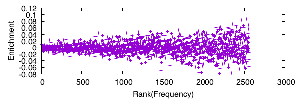
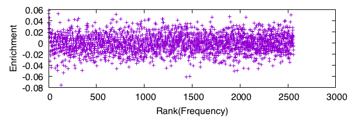

# Method

## Sequence Trimming

The FASTQ files consist of four lines per read. The second of these lines contains the sequence of the read. Each sequence line is extracted and, together with its reverse complement, searched for the 5' and 3' primers. If a 5' primer is found followed by a 3' primer, the interceding sequence (i.e. the oligomer) is extracted. The oligomer is kept only if it is 20 nucleotides in length. This computational procedure is performed for all of the reads in each FASTQ file.

## Kmer Extraction

Each oligomer is decomposed into k-mers. For example, for k=9, the oligomer 

```
ATGCATGCATGC
```

is decomposed into the following sequences:

```
ATGCATGCA
 TGCATGCAT
  GCATGCATG
   CATGCATGC
```

The resulting k-mers (k=5, ..., 15) are tabulated for rounds 1 and 2 and then the resulting tables are joined. The resulting table, hereafter referred to as the k-mer table, contains three columns, with one row per k-mer. The first column is the sequence of the k-mer, the second column is the number of times the k-mer is found in round 1, and the third column is the number of times the k-mer was found in round 2. These counts were converted to a frequency value to adjust for unequal sample sizes between rounds. 

## Choosing K Using KL Divergence

The Kullback-Leibler (KL) divergence is a pseudo-distance metric for probability distributions. It is used to measure the difference between the k-mer distributions of rounds 1 and 2. A high KL divergence between rounds suggests a substantial change the k-mer distirbution, which in turn suggests substantial selective pressure. We assume that the most substantial selective pressure would come from binding of the k-mer to the protein and therefore look to the KL divergence to select the most relevant value of k. 

## Square Root Transformation of Frequency Values

Before calculating enrichment for the k-mers, a square root transform is applied to the frequency values of the k-mer table. The purpose of this transform is to alleviate bias towards high-frequency k-mers. The bias likely occurs because the DNA from which a k-mer arises acts as its own catalysts during PCR, causing the extent of change (enrichment or depletion) between rounds to scale with the frequency level of the k-mer. Empirically, the square root transform was found to correct for this (see Results). 

# Results

The KL divergence was used to select the most relevant value of k. The KL
divergence reached a maximum when k=12; therefore, our analysis
focused on 12-mers. 

The square root transform was found to stabilize the variance in
enrichment/depletion values across the k-mer pools (Figure 1, Figure 2).





Enrichment was calculated as the difference square root-transformed frequency values of rounds 1 and 2.

The most enrichmed 12-mers are compared against those
of the negative control (Figure 3).


The following tables highlight the most enriched 12-mers and their associated
values for both protein and negative control.

Sequence        Cnt1  Cnt2  Freq1  Freq2  V1     V2     Delta
----            ----  ----  ----   ----   ----   ----   ----
`AATCGGCACGGC`  1     11    0.003  0.034  0.055  0.186  0.130
`GTGGCGTGTTCC`  1     9     0.003  0.028  0.055  0.168  0.113
`TTGCACCTACGC`  1     8     0.003  0.025  0.055  0.158  0.103
`TGACCACGTGGG`  1     8     0.003  0.025  0.055  0.158  0.103
`TCCACTTCGGCG`  1     8     0.003  0.025  0.055  0.158  0.103
`TACGCCTGCATG`  1     8     0.003  0.025  0.055  0.158  0.103
`CGAGTCTGCGCC`  1     8     0.003  0.025  0.055  0.158  0.103
`CCGACGCCGCCT`  1     8     0.003  0.025  0.055  0.158  0.103
`CCCTGCAGTGCT`  1     8     0.003  0.025  0.055  0.158  0.103
`AGGGTCTCCGCG`  1     8     0.003  0.025  0.055  0.158  0.103

Table: Maximally enriched 12-mers for NC (Cnt: Count, Freq: Frequency, V:
Variance Stabilized Frequency, Delta: Change in V between R2 and R1)

Sequence        Cnt1  Cnt2  Freq1  Freq2  V1     V2     Delta
----            ----  ----  ----   ----   ----   ----   ----
`TTCTCGCCAGCG`  1     7     0.003  0.019  0.052  0.139  0.087
`TCGCTGCGTGAT`  1     7     0.003  0.019  0.052  0.139  0.087
`TCCGGTAGCTCA`  1     7     0.003  0.019  0.052  0.139  0.087
`GTCGGCATACCA`  1     7     0.003  0.019  0.052  0.139  0.087
`GTCAGCTACGTT`  1     7     0.003  0.019  0.052  0.139  0.087
`GGGCGAACGACG`  1     7     0.003  0.019  0.052  0.139  0.087
`GGCCGTGATCTG`  1     7     0.003  0.019  0.052  0.139  0.087
`GAAGCGTCCGGG`  1     7     0.003  0.019  0.052  0.139  0.087
`CTGGTGCACTGC`  1     7     0.003  0.019  0.052  0.139  0.087
`CGACCCTCGAGC`  1     7     0.003  0.019  0.052  0.139  0.087

Table: Maximally enriched 12-mers for 89aa (Cnt: Count, Freq: Frequency, V:
The same process was run 

# Alternate Parmaeter Settings

* Error in primer trim set to 0
* Length filter in pipeline set to 20
* These perfect oligmers are stored under the `data/`
